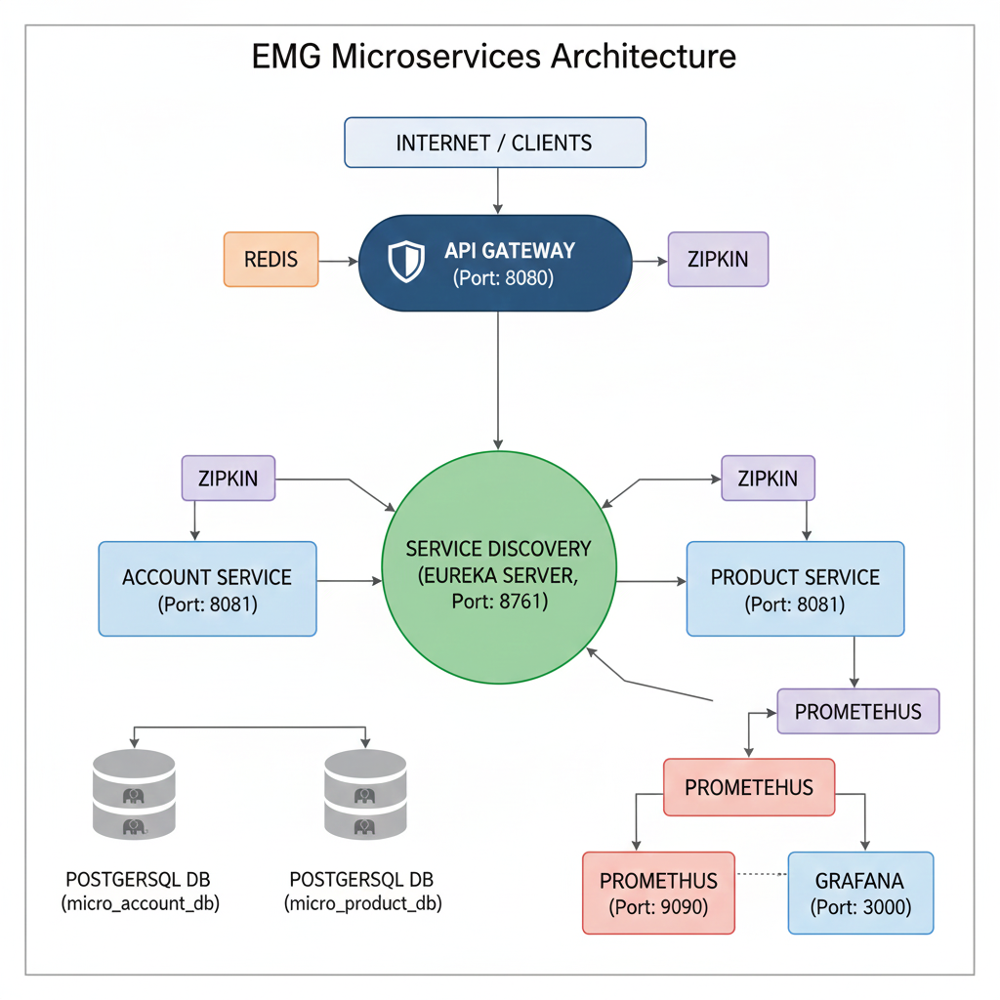
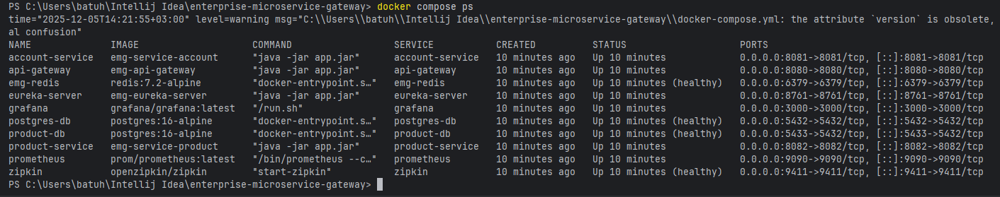
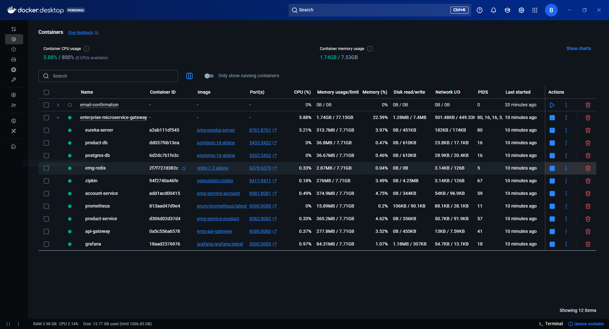

# 🚀 Spring Cloud Observable Microservices

[](LICENSE)
[](https://adoptium.net/temurin/releases/?version=17)
[](https://spring.io/projects/spring-boot)

## 🌟 Projeye Genel Bakış

Bu proje, bir e-ticaret altyapısının temel servislerini modern, dağıtık ve güvenli bir yaklaşımla hayata geçirmek amacıyla **Java 17** ve **Spring Cloud** ekosistemi kullanılarak geliştirilmiştir. Projenin ana hedefi, geleneksel monolitik yapıların sınırlamalarından kurtularak **ölçeklenebilirliği**, **esnekliği** ve **hata yalıtımını (fault isolation)** en üst düzeye çıkarmaktır.

Sistem, temel **Kullanıcı Hesapları (`Account`)** ve **Ürün Katalogu (`Product`)** servislerinden oluşur. Gelen tüm trafik, güvenlik kontrollerinden sonra merkezi bir kapı görevi gören **API Gateway** üzerinden yönlendirilir.



---

## 1. Mimari Derinlik: Bağımsızlık, Esneklik ve Yönetim

Bu proje, dağıtık sistemler prensiplerine uygunluğunu gösteren aşağıdaki temel yapısal kararları içerir:

### 1.1. Hizmet Keşfi (Service Discovery)
Mimariye doğal bir **esneklik** ve **otomatik yük dengeleme** yeteneği kazandırmak için **Spring Cloud Eureka** kullanılmıştır. Her servis (Account, Product) başladığında kendini Eureka Server'a kaydeder. **API Gateway**, bir istek yönlendirirken servisin anlık adresini bilmek zorunda kalmaz, sadece Eureka'ya sorar.

### 1.2. Veri Bağımsızlığı: Her Servisin Kendi Veritabanı
En önemli mimari kararlardan biri **Veri Bağımsızlığı** ilkesidir. Her mikroservis kendi verisinden sorumludur. Bu, **Account Service** için ayrı bir PostgreSQL konteyneri ve **Product Service** için ayrı bir PostgreSQL konteyneri tanımlanarak hayata geçirilmiştir. Bu ayrım, servisler arasında **gevşek bağlantı (loose coupling)** sağlar ve veri yükünün tek bir noktada toplanmasını önler.

### 1.3. Sistem Bileşenleri


| Bileşen | Port | Rolü |
| :--- | :--- | :--- |
| **Eureka Server** | `8761` | Merkezi Servis Keşif Mekanizması. |
| **API Gateway** | `8080` | Tüm istemci isteklerinin giriş noktasıdır; yönlendirme ve merkezi güvenlikten sorumludur. |
| **Account Service** | `8081` | Kullanıcı hesapları ve profillerini yönetir. |
| **Product Service** | `8082` | Ürün envanteri ve kataloğunu yönetir. |
| **PostgreSQL** | `5432` | Kalıcı veritabanı örnekleri. |
| **Zipkin** | `9411` | Dağıtılmış İzleme Sistemi. |
| **Prometheus** | `9090` | Metrik Toplama Aracı. |
| **Grafana** | `3000` | Metrik Görselleştirme Paneli. |
| **Redis** | `6379` | **Güvenlik Mekanizması için JWT Kara Listesi (Blacklisting) deposu olarak kullanılır.** |

---

## 2. Güvenlik Mekanizmaları: Ön ve Arka Cephe Savunması

Dağıtık sistemlerdeki güvenlik açığını kapatmak için iki aşamalı bir strateji uygulanmıştır:

### 2.1. Ön Cephe Güvenliği (API Gateway)
Tüm kullanıcı istekleri için merkezi kimlik doğrulama, **Spring Cloud Gateway** üzerinde **JWT (JSON Web Token)** kullanılarak uygulanmıştır.

* **Token Kara Listesi (Blacklisting):** Kullanıcı **çıkış yaptığında (Logout)**, token süresi dolmamış olsa bile **Redis** üzerinde anında kara listeye alınır. Bu mekanizma, oturum sonlandırma işlemlerinin anında gerçekleşmesini sağlayarak güvenlik zafiyetlerini minimuma indirir.

### 2.2. Arka Cephe Güvenliği (İç Savunma)
Servisler arası iletişimin güvenliğini sağlamak amacıyla, mikroservislerin dış dünyadan doğrudan erişimi engellenmiştir.

* **`X-Internal-Secret` Doğrulama:** Gateway, yönlendirdiği isteklere özel bir gizli anahtar olan **`X-Internal-Secret`** başlığını ekler.
* **`InternalAccessFilter`:** Her arka uç servis (**Account** ve **Product**), gelen isteği işleme almadan önce bu anahtarı kontrol eden bir **`InternalAccessFilter`** kullanır. Bu filtre, yalnızca **güvenilir API Gateway**'den gelen isteklere yanıt verilmesini garantiler.

---

## 3. Gözlemlenebilirlik (Observability) ve Performans Analizi

Dağıtık bir sistemin sağlığını ve performansını anlık olarak izleme yeteneği, projenin operasyonel olgunluğunu gösterir.

* **Dağıtık İzleme (Tracing) - Zipkin:** Tüm servislerde, bir API isteği birden fazla servisten geçtiğinde, isteğin tüm yaşam döngüsü tek bir kimlik (`Trace ID`) altında **Zipkin**'de izlenir. Bu, gecikme sürelerinin (latency) ve hata noktalarının saniyeler içinde tespit edilmesini sağlar.
* **Metrikler ve Görselleştirme - Prometheus & Grafana:** Servislerin CPU, bellek ve istek süresi gibi kritik metrikleri **Micrometer** aracılığıyla toplanır ve **Prometheus**'a sunulur. **Grafana** ise bu verileri kullanarak sistemin anlık sağlık durumunu anlaşılır panolar üzerinden takip etme imkanı sunar.

---

## 4. Proje Ekosistemi ve Geliştirme Araçları

| Kategori | Teknoloji | Açıklama |
| :--- | :--- | :--- |
| **Geliştirme** | Java 17, Spring Boot 3, Maven | Kurumsal düzeyde hızlı uygulama geliştirme ortamı. |
| **Mikroservisler** | Spring Cloud Eureka, Spring Cloud Gateway | Dinamik keşif, merkezi yönlendirme ve yük dengeleme. |
| **Güvenlik** | Spring Security, JWT, Redis | Merkezi kimlik doğrulama ve anında **token iptali**. |
| **Veritabanı** | PostgreSQL, Spring Data JPA | Güvenilir ve ilişkisel veri yönetimi. |
| **Konteynerleştirme** | Docker, Docker Compose | Geliştirme/Test ortamını tek komutla kurma yeteneği. |
| **Gözlemlenebilirlik** | Zipkin, Prometheus, Grafana | Sistemin performans ve sağlık takibi. |
| **Geliştirme Araçları** | **PGAdmin 4**, **DBeaver**, **Postman** | Veritabanı yönetimi, SQL istemcisi ve API testi için kullanılan profesyonel araçlar. |

---

## 5. Kurulum ve Başlatma Kılavuzu

Proje, tüm bağımlılıkları (DB'ler, Redis, İzleme araçları) içerdiği için kurulumu **Docker Compose** ile basitleştirilmiştir.

### 5.1. Ön Gereksinimler

* JDK 17 veya üstü
* Apache Maven
* Docker ve Docker Compose

### 5.2. Başlatma Adımları

1.  **Kodları Derleyin:** Proje ana dizinine gidin ve tüm servisleri derleyin:
    ```bash
    mvn clean package -DskipTests
    ```
2.  **Sistemi Başlatın:** `docker-compose.yml` dosyasının bulunduğu dizinde başlatma komutunu çalıştırın:
    ```bash
    docker compose up --build -d
    ```

### 5.3. Bağlantı Noktaları ve Paneller

| Bileşen | Adres | Amaç |
| :--- | :--- | :--- |
| **Tüm API İstekleri** | `http://localhost:8080` | **API Gateway** (Postman ile testler buraya yapılır) |
| **Hizmet Keşfi** | `http://localhost:8761` | Eureka Dashboard |
| **İzleme (Tracing)** | `http://localhost:9411` | Zipkin Arayüzü |
| **Metrikler (Grafana)** | `http://localhost:3000` | Görselleştirme Arayüzü (Giriş: `admin/admin`) |

### 5.4. Başlangıç Kanıtı

Aşağıdaki ekran görüntülerini bu kısma ekleyerek projenizin başarılı bir şekilde çalıştığını görsel olarak kanıtlayabilirsiniz:

#### 1. 🖥️ Docker Konteyner Durumları (`docker compose ps` Çıktısı)

Bu terminal çıktısı, tüm mikroservis ve altyapı konteynerlerinin (**`postgres-db`** ve **`product-db`** için **`healthy`**, diğer uygulamalar için **`up`** veya **`running`**) ayağa kalktığını ve Docker tarafından sorunsuz yönetildiğini kanıtlar.



---

#### 2. 🐳 Docker Desktop Dashboard (Genel Bakış)

Docker Desktop uygulaması ekran görüntüsü, tüm sistemin tek bir proje altında, yeşil veya mavi renkte **Running** (Çalışıyor) durumunda olduğunu görsel olarak teyit eder.



---

#### 3. 🟢 Eureka Servis Kaydı (Hizmet Keşfi Kanıtı)

Eureka Dashboard ekranı, mikroservislerinizin (Gateway, Account, Product) başarılı bir şekilde merkezi kayıt defterine kaydolduğunu ve **`UP`** (Ayakta) durumunda olduğunu göstererek **Hizmet Keşfi** mekanizmasının doğru çalıştığını kanıtlar.


## 6. Lisans

Bu proje açık kaynaklıdır ve **MIT Lisansı** altında yayımlanmıştır.
